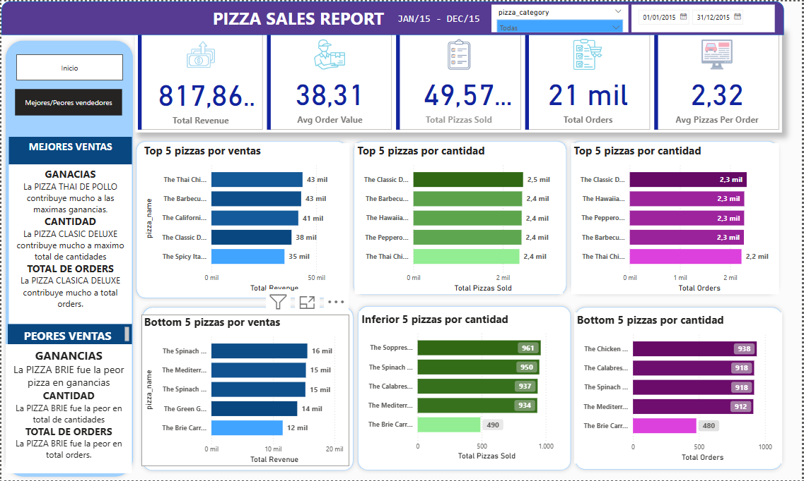

# Power BI Dashboard

Este es un proyecto de Power BI que muestra visualizaciones sobre [tema del proyecto].

## Instrucciones
1. Descarga el archivo 'pizza_sales' y `nombre-proyecto.pbix`.
2. El archivo de pizza_sales sera la database, y la conetaremos al SQL mediante el program: SQL MANAGEMENT STUDIO.
3. Averiguar todos kpis posibles sobre el negocio.
4. Ábre el Power BI Desktop para ver las visualizaciones y conetctarlo con el SQL.
5. Asegúrate de conectar los datos si están disponibles externamente.

## Herramientas
1. SQL
2. POWER BI

## Resultado final

